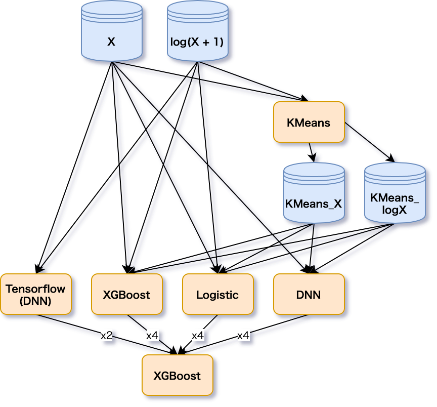
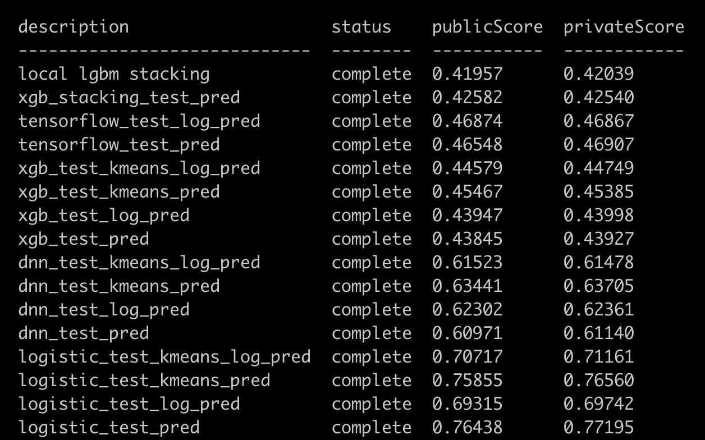

# bqml-tutorial
BQMLのチュートリアルレポジトリ

# 概要

Kaggleの[Otto Group Product Classification Challenge](https://www.kaggle.com/c/otto-group-product-classification-challenge/overview)のデータを用いたBQMLの試用レポジトリです。
このレポジトリでは以下の機能を試しています。
- ロジスティック回帰
- KMeans
- XGBoost
- DNN
- Tensorflow modelのインポート

資料については[こちら](https://speakerdeck.com/shimacos/bqmlkotohazime)

# 前準備

## データのダウンロード
- `./input/otto/`以下に[Otto Group Product Classification Challenge](https://www.kaggle.com/c/otto-group-product-classification-challenge/overview)からダウンロードしたデータを解凍して下さい。
```bash
$ kaggle competitions download -c otto-group-product-classification-challenge -p ./input/otto
$ unzip input/otto/otto-group-product-classification-challenge.zip -d ./input/otto
```

## GCP関連の設定
`invoke.yaml`に使用するGCPのproject_id, GCS (tensorflowモデルのアウトプットに使用します)のbucketの名前を記入して下さい。

## ライブラリのinstall
本プロジェクトはpoetryを使用しています。
以下の手順でpyenvとpoetryでライブラリをinstallしてください。
- pyenv, poetryのインストール (必要な方のみ)
```bash
# install pyenv
$ git clone git://github.com/yyuu/pyenv.git ~/.pyenv
$ echo 'export PYENV_ROOT="$HOME/.pyenv"' >> ~/.bashrc [or your configuration file (ex. ~/.zshrc)]
$ echo 'export PYENV_ROOT="$HOME/.pyenv"' >> ~/.bashrc
$ echo 'eval "$(pyenv init -)"' >> ~/.bashrc
$ source ~/.bashrc

# install poetry
$ curl -sSL https://raw.githubusercontent.com/python-poetry/poetry/master/get-poetry.py | python
$ source $HOME/.poetry/env

# Set virtualenv in project
$ pyenv install 3.7.7
$ pyenv local 3.7.7
$ poetry config virtualenvs.in-project true
```
- ライブラリのインストール
```bash
$ poetry install
```

## BigQueryにcsvをアップロード

上で解凍したデータをBigQueryにアップロードします。
デフォルトでデータセット名は`otto`となっていることを想定しているので、変更しないでください。
```bash
$ poetry run inv upload-data
```

# パイプライン

元の特徴量とlogを取った特徴量、Kmeansのクラスタ中心までの距離特徴を各modelに突っ込むシンプルなStackingパイプラインです。
<div align="center">

</div>

# 結果

localでやった方がスコアが高くなってしまうので要調査。
KNNなしで銀圏近くまでいけてるので及第点くらいのスコアは出ていそう。

<div align="center">

</div>

# コマンド一覧

一つ一つ動作を確認したい場合はコマンドを個別実行してください。  
一度に最後まで動かしたい場合は、`poetry run inv all`が便利です。(**課金が発生するので注意してください**)

| コマンド                                       | 実行内容                                    | オプション                                                                                                                                                    | 
| ---------------------------------------------- | ------------------------------------------- | ------------------------------------------------------------------------------------------------------------------------------------------------------------- | 
| `poetry run inv train-model`                   | モデルの訓練                                | `--model-name`: 使用するモデルを選択(logistic, dnn, xgbから選択), <br>`--use-log-feature`: ログを取った特徴量を使用, <br>`--use-kmeans-feature`: kmeansの特徴量を追加 | 
| `poetry run inv train-kmeans-model`            | KMeansの訓練                                | `--use-log-feature`: ログを取った特徴量を使用                                                                                                                 | 
| `poetry run inv predict-oof-model`             | OOFの予測                                   |  `--model-name`: 使用するモデルを選択(logistic, dnn, xgbから選択), <br>`--use-log-feature`: ログを取った特徴量を使用, <br>`--use-kmeans-feature`: kmeansの特徴量を追加 | 
| `poetry run inv predict-test-model`            | テストデータの予測                          |  `--model-name`: 使用するモデルを選択(logistic, dnn, xgbから選択), <br>`--use-log-feature`: ログを取った特徴量を使用, <br>`--use-kmeans-feature`: kmeansの特徴量を追加 | 
| `poetry run inv evaluate-model`                | モデルの評価指標をevalテーブルにinsert      |  `--model-name`: 使用するモデルを選択(logistic, dnn, xgbから選択), <br>`--use-log-feature`: ログを取った特徴量を使用, <br>`--use-kmeans-feature`: kmeansの特徴量を追加 | 
| `poetry run inv train-tensorflow-model`        | TensorflowのDNNをlocalで訓練                | `--use-log-feature`: ログを取った特徴量を使用                                                                                                                 | 
| `poetry run inv upload-models`                 | GCSにtensorflowモデルをアップロード         |                                                                                                                                                               | 
| `poetry run inv import-tensorflow-model`       | GCSからBQにモデルをインポート               |                                                                                                                                                               | 
| `poetry run inv predict-oof-tensorflow-model`  | TensorflowモデルによるOOFの予測             |                                                                                                                                                               | 
| `poetry run inv predict-test-tensorflow-model` | Tensorflowモデルによるテストデータの予測    |                                                                                                                                                               | 
| `poetry run inv train-stacking-model`          | Stackingモデルの訓練                        | `--model-name`: 使用するモデルを選択(dnn, xgbから選択)                                                                                                        | 
| `poetry run inv predict-oof-stacking-model`    | StackingモデルによるOOFの予測               | `--model-name`: 使用するモデルを選択(dnn, xgbから選択)                                                                                                        | 
| `poetry run inv predict-test-stacking-model`   | Stackingモデルによるテストデータの予測      | `--model-name`: 使用するモデルを選択(dnn, xgbから選択)                                                                                                        | 
| `poetry run inv make-submission`               | submissionデータを作成                      | `--pred-table-id`: テストデータを予測したデータセットの名前を指定                                                                                             | 
| `poetry run inv train-first-stage`             | 1段階目のモデルを全て訓練                   |                                                                                                                                                               | 
| `poetry run inv predict-oof-all`               | 1段階目のモデルによるOOFを全て予測          |                                                                                                                                                               | 
| `poetry run inv predict-test-all`              | 1段階目のモデルによるテストデータを全て予測 |                                                                                                                                                               | 
| `poetry run inv make-submission-all`           | 全てのサブミッションファイルを作成          |                                                                                                                                                               | 
| `poetry run inv all`                           | 訓練からStacking, Submissionまで全て行う    |                                                                                                                                                               | 

